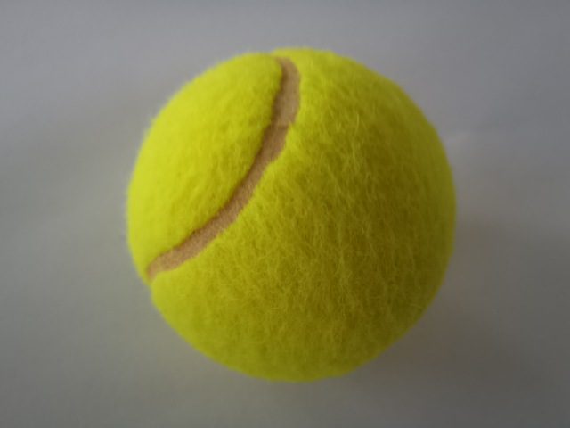
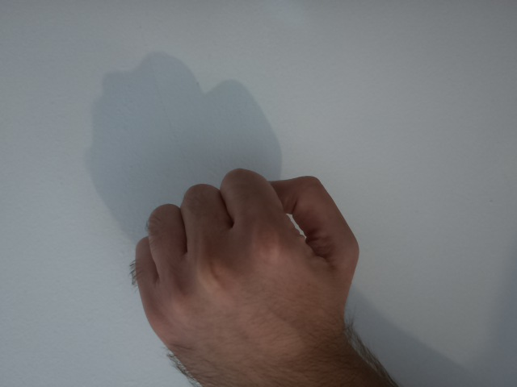
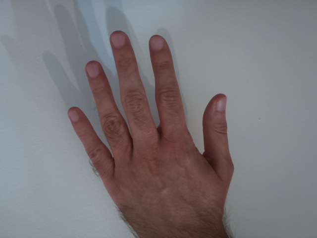
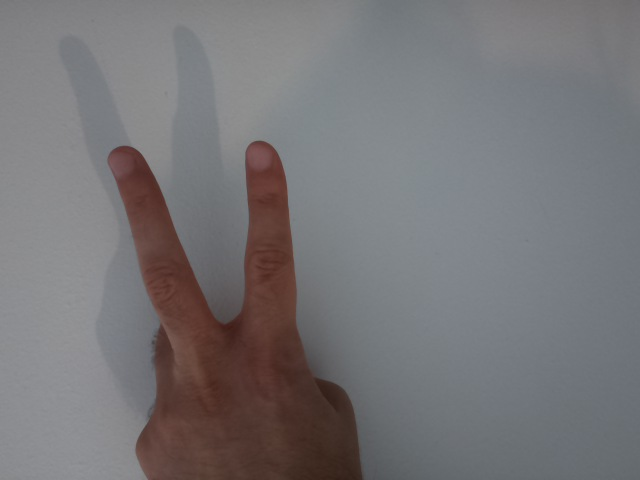

### C++ image classifier with TensorFlow Lite on Raspberry Pi

#### Prerequisites
* hardware:
    * Raspberry Pi 4 model B
    * 8 GB microSD card
    * Raspberry Pi Camera module 3
* software:
    * 64-bit Raspberry Pi OS
    * g++ (with C++20 support)
    * make
    * libpthread
    * libcamera
    * libgstreamer

#### Install
    sh install.sh

#### Compile
    make build [-j <number-of-jobs>]

#### Run
    make run \
        [LABELS=<path-to-labels>] \
        [MODEL=<path-to-model>] \
        [IN_IMAGE=<path-to-input-image>] \
        [OUT_IMAGE=<path-to-output-image>] \
        [NUM_THREADS=<number-of-threads>] \
        [PLAY_RPS=YES]

#### Clean up
    make clean

#### Uninstall
    sh uninstall.sh

#### Example
Giving  as input to:

    make run \
        LABELS=models/labels_mobilenet_quant_v1_224.txt \
        MODEL=models/mobilenet_v1_1.0_224_quant.tflite \
        IN_IMAGE=images/tennis_ball_input.jpeg \
        NUM_THREADS=4

then the result is:

    inference duration: 33 ms
    0.96 | tennis ball

With a 96% probability the image represents a tennis ball.

### Train Rock-Paper-Scissors lite model in Python with TensorFlow

#### Prerequisites
* hardware:
    * development machine
* software:
    * Linux OS
    * Python
    * tensorflow Python module
    * opencv-python
* data:
    * https://storage.googleapis.com/mediapipe-tasks/gesture_recognizer/rps_data_sample.zip
    * https://www.kaggle.com/datasets/sanikamal/rock-paper-scissors-dataset

#### Prepare data
    mkdir -p data/raw
    unzip rps_data_sample.zip
    cp -r rps_data_sample/paper data/raw
    cp -r rps_data_sample/rock data/raw
    cp -r rps_data_sample/scissors data/raw

or

    mkdir -p data/raw
    unzip rock-paper-scissors-data.zip
    cp -r Rock-Paper-Scissors/train/* data/raw

#### Train model
    python train_rps_lite_model.py

#### Deploy model
Copy `rps_labels.txt` and `rps_model.tflite` on a Raspberry Pi.

### C++ Rock-Paper-Scissors hand gesture recognition with TensorFlow Lite on Raspberry Pi

The same `image_classifier` application is able to perform Rock-Paper-Scissors hand gesture recognition.

#### Rock example
Giving  as input to:

    make run \
        LABELS=models/rps_labels.txt \
        MODEL=models/rps_big_dataset_model.tflite \
        IN_IMAGE=images/rock_input.jpeg \
        NUM_THREADS=4

then the result is:

    inference duration: 70 ms
    0.96 | rock

With a 96% probability the image represents Rock.

#### Paper example
Giving  as input to:

    make run \
        LABELS=models/rps_labels.txt \
        MODEL=models/rps_big_dataset_model.tflite \
        IN_IMAGE=images/paper_input.jpeg \
        NUM_THREADS=4

then the result is:

    inference duration: 70 ms
    1.00 | paper

With a 100% probability the image represents Paper.

#### Scissors example
Giving  as input to:

    make run \
        LABELS=models/rps_labels.txt \
        MODEL=models/rps_big_dataset_model.tflite \
        IN_IMAGE=images/scissors_input.jpeg \
        NUM_THREADS=4

then the result is:

    inference duration: 71 ms
    0.94 | scissors

With a 94% probability the image represents Scissors.

